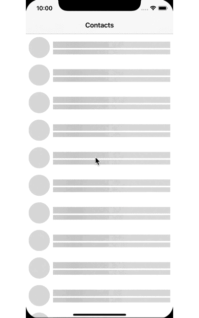

###The library is the Objc Version of [Skeleton](https://github.com/gonzalonunez/Skeleton)


[](https://travis-ci.org/mayqiyue/OCSkeleton)
[](http://cocoapods.org/pods/OCSkeleton)
[](http://cocoapods.org/pods/OCSkeleton)
[](http://cocoapods.org/pods/OCSkeleton)    

OCSkeleton is an easy way to create sliding CAGradientLayer animations! It works great for creating skeleton screens:



## 👩‍💻 Usage

The entire library comes down to just one public-facing extension:

```ObjC
@interface OCGradientLayer : CAGradientLayer

- (void)slideToDir:(OCDirection)direction animations:(void (^)(CAAnimationGroup *))group;

- (void)stopSliding;

@end

```

You can check out the example for more.


## 📚 Example

To run the example project, clone the repo, and run `pod install` from the Example directory first.

## 🛠 Installation

OCSkeleton is available through [CocoaPods](http://cocoapods.org). To install
it, simply add the following line to your Podfile:

```ruby
pod 'OCSkeleton'
```

## Author

mayqiyue, xu20121013@gmail.com

## License

OCSkeleton is available under the MIT license. See the LICENSE file for more info.
